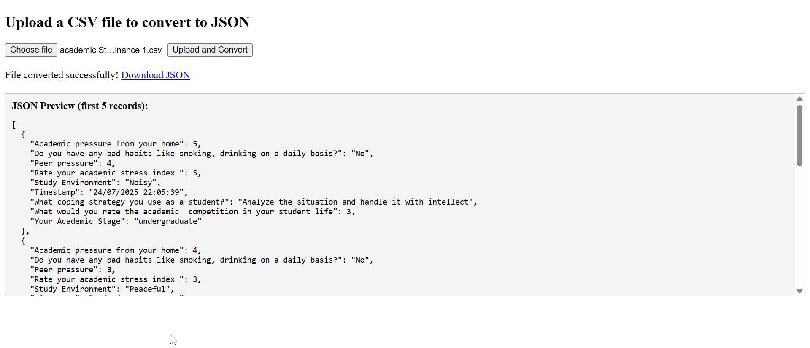

# CSV to JSON Converter with Flask 

This project provides a simple web application to convert CSV files to JSON format using **Flask**. The user can upload a CSV file, and the system will convert it into a JSON format and provide both a preview of the JSON data and the option to download the JSON file. 




## Features

- Upload a CSV file.
- Convert the CSV data into a JSON format.
- Preview the first 5 records of the converted JSON.
- Download the full JSON file after conversion.
- Handles `NaN` and `None` values in CSV files.

## Technologies Used

- **Flask** - A micro web framework for Python to build the backend.
- **Pandas** - A powerful data manipulation library to handle CSV to JSON conversion.
- **HTML/CSS/JavaScript** - Frontend for the user interface and handling file uploads asynchronously.


## 🚀 Getting Started

### Prerequisites

Make sure you have the following installed:

- Python (version 3.7 or above)
- `pip` (Python package manager)

### Setup Instructions

1.  **Clone the repository:**

    ```bash
    git clone git clone https://github.com/AbdulRehman028/100-days-of-ai.git
    cd csv-to-json-converter
    ```

2.  **Create a virtual environment:**

    ```bash
    python3 -m venv venv
    venv\Scripts\activate # On Windows, use
    source venv/bin/activate  # On Mac/Linux
    ```

3.  **Install the required dependencies:**

    ```bash
    pip install -r requirements.txt
    ```

4.  **Run the Flask app:**

    ```bash
    python app.py
    ```

    The app will run on `http://127.0.0.1:5000/`.


## How It Works

1.  **Upload CSV File:**
    - Open the application in your browser (`http://127.0.0.1:5000/`).
    - Upload a CSV file using the file input form.

2.  **CSV Conversion to JSON:**
    - The backend will convert the uploaded CSV file into a JSON format.
    - You will see a preview of the first 5 records of the converted JSON below the upload form.

3.  **Download the JSON File:**
    - After conversion, a download link for the JSON file will appear.
    - Click the link to download the full JSON file.


## Example

### Input CSV

```csv
Name,Age,Country
Alice,25,USA
Bob,30,Canada
Charlie,22,UK
```

### Output JSON

```[
  {
    "Name": "Alice",
    "Age": 25,
    "Country": "USA"
  },
  {
    "Name": "Bob",
    "Age": 30,
    "Country": "Canada"
  },
  {
    "Name": "Charlie",
    "Age": 22,
    "Country": "UK"
  }
]
```
### File Structure

```csv-to-json-converter/
├── app.py                  # Main Flask app
├── index.html              # HTML form for uploading CSV
├── uploads/                # Directory to store uploaded CSV files
├── json_files/             # Directory to store converted JSON files
├── requirements.txt        # Python dependencies
└── README.md               # Project documentation
```


### Troubleshooting
- "File format error": Ensure you are uploading a valid .csv file.

- "Error: Invalid file content": Make sure the CSV file is properly formatted without any invalid characters.

### Contributions
Feel free to fork the repository, make improvements, and submit pull requests. If you encounter bugs or issues, open an issue on the repository.

## 👨‍💻 Developer
Developed by **M.Abdul Rehman Baig** ❤️

---

⭐ **If you found this project helpful, please give it a star!** ⭐