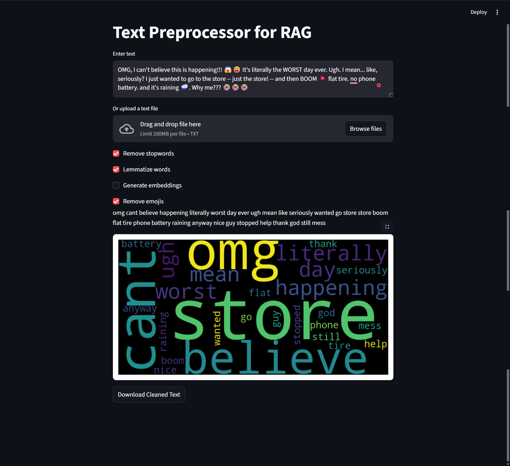

# Text Preprocessor for RAG Pipelines

## Project Description

This is a web application designed to preprocess text data, making it ready for use in Retrieval-Augmented Generation (RAG) pipelines. The application provides an intuitive user interface built with Streamlit, where users can either input text directly or upload a text file. The preprocessing steps are customizable and include removing emojis, punctuation, and hashtags, converting text to lowercase, removing common stopwords, and lemmatizing words. The end product is a downloadable file of the cleaned text and a JSON file containing generated embeddings, along with a visual word cloud of the processed text.



## Features

- **Input:** Accepts direct text input or file upload (.txt).
- **Customizable Preprocessing:**
    - Removes emojis.
    - Removes punctuation.
    - Removes hashtags.
    - Converts text to lowercase.
    - Removes a standard list of English stopwords.
    - Lemmatizes words to their base form.
- **Output:**
    - Displays the cleaned text.
    - Generates and displays a word cloud visualization.
    - Generates text embeddings using the `all-MiniLM-L6-v2` model from Hugging Face.
- **Downloadable Results:**
    - Download the cleaned text as a `.txt` file.
    - Download the generated embeddings and the cleaned text as a `.json` file.

## Tech Stack

- **Python:** The core programming language.
- **Streamlit:** For building the interactive web application UI.
- **NLTK (Natural Language Toolkit):** For text preprocessing tasks like tokenization, stop word removal, and lemmatization.
- **Hugging Face `sentence-transformers`:** For generating high-quality text embeddings.
- **WordCloud:** For visualizing word frequencies in the processed text.
- **Matplotlib:** For displaying the word cloud plot.

## Prerequisites

- Python 3.7 or higher

## Installation

1.  **Clone the repository:**
    ```bash
    git clone git clone https://github.com/AbdulRehman028/100-days-of-ai.git
    cd Day-03-Text-Preprocessor
    ```

2.  **Create a virtual environment (recommended):**
    ```bash
    python -m venv venv
    ```

3.  **Activate the virtual environment:**
    - **On Windows:**
      ```bash
      venv\Scripts\activate
      ```
    - **On macOS/Linux:**
      ```bash
      source venv/bin/activate
      ```

4.  **Install the required packages:**
    First, create a `requirements.txt` file in your project directory with the following content:
    ```
    streamlit
    nltk
    wordcloud
    matplotlib
    sentence-transformers
    ```
    Then, run the installation command:
    ```bash
    pip install -r requirements.txt
    ```

## How to Run

1.  Ensure your virtual environment is activated.
2.  Run the Streamlit application from your terminal:
    ```bash
    streamlit run text_preprocessor_app.py
    ```
    This will open the web app in your default browser.

## How to Use

1.  On the web page, you can either type text into the text area or upload a `.txt` file.
2.  Check or uncheck the options on the sidebar to customize the preprocessing steps (e.g., "Remove       stopwords," "Lemmatize words," "Generate embeddings").
3.  Click the "Preprocess Text" button to see the results.
4.  The cleaned text and a word cloud will be displayed.
5.  If "Generate embeddings" is checked, a preview of the embedding will be shown, and a download button for the JSON file will appear.
6.  Use the download buttons to save the cleaned text and embeddings.

## Project Structure

/100-Days-of-AI/
├── Day-03-Text-Preprocessor/
│   ├── text_preprocessor_app.py   # The main Streamlit application
│   ├── README.md                  # This file
│   └── requirements.txt           # List of dependencies
└── ...

## 👨‍💻 Developer
Developed by **M.AbdulRehman Baig** ❤️

---

⭐ **If you found this project helpful, please give it a star!** ⭐