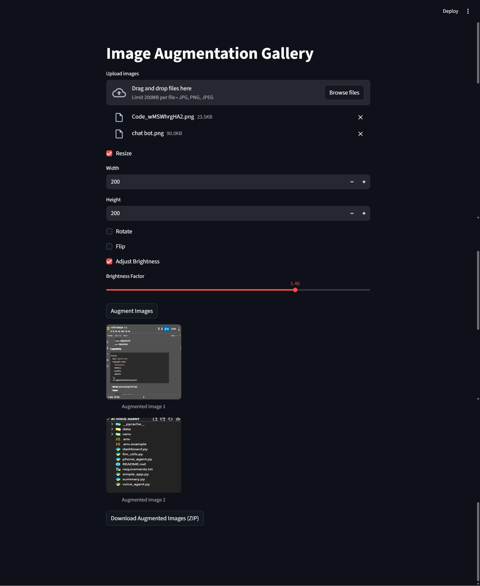

## 🚀 Overview
The **Image Augmentation Gallery** is a **Streamlit-based web app** that lets you:
- Upload multiple images  
- Apply augmentations (resize, rotate, flip, brightness)  
- Preview results in an interactive gallery  
- Download a **ZIP file** of all augmented images  

Perfect for **dataset generation, preprocessing for ML models, or creative editing.**

  
  
 



## ✨ Features
- 📂 Upload multiple images (JPG/PNG)  
- 🔄 Resize (custom width & height)  
- 🎛️ Rotate (–180° to +180°)  
- 🔃 Flip (horizontal)  
- 🌞 Adjust Brightness (0.1 – 2.0)  
- 🖼️ Preview augmented gallery  
- 📦 Download as ZIP  


## 🛠️ Tech Stack
- **Python** 🐍  
- **Streamlit** 🎨 – Interactive web UI  
- **Pillow (PIL)** 🖌 – Image processing  
- **Zipfile & io** 📦 – Bundling results  


## 📂 Workflow
1. **Upload** → Select JPG/PNG images  
2. **Choose** → Pick augmentations (resize, rotate, etc.)  
3. **Preview** → See augmented results instantly  
4. **Download** → Export all augmented images as a `.zip`  


## 🎯 Use Cases
- 🧠 AI/ML Dataset Generation  
- ⚡ Quick Image Preprocessing  
- 🎨 Creative Image Editing  
- 📚 Teaching Image Augmentation  


## ⚡ Installation & Usage

```bash
# Clone repo
    git clone git clone https://github.com/AbdulRehman028/100-days-of-ai.git
    cd Day-04-Text-Image-augmenter

# Install dependencies
pip install streamlit pillow

# Run app
streamlit run app.py

## 👨‍💻 Developer
Developed by **M.AbdulRehman Baig** ❤️

---

⭐ **If you found this project helpful, please give it a star!** ⭐