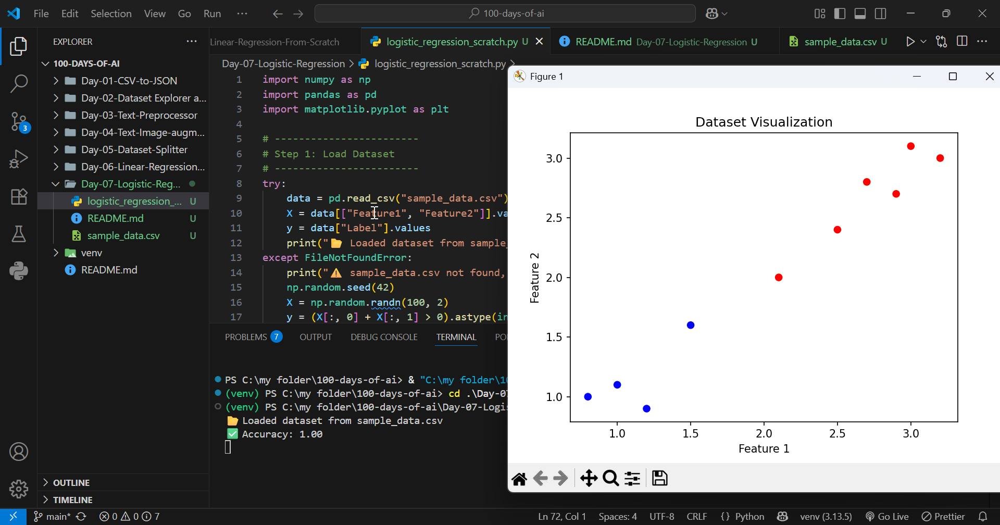

# 📊 Project 07 - Logistic Regression from Scratch

## 📌 Overview
This project implements **Logistic Regression** from scratch using only **NumPy**.  
We manually define the **sigmoid function, gradient descent, and prediction rule**.



## 🚀 How to Run
1. Activate your environment:
   ```bash
   venv\Scripts\activate
   cd .\Day-07-Logistic-Regression\
   python logistic_regression_scratch.py