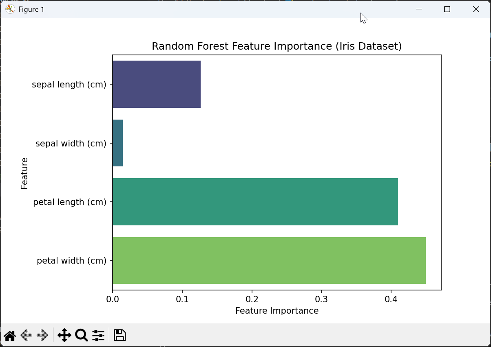

# 🌲 Project 13 - Random Forest Classifier with Scikit-Learn

## 📌 Overview
This project demonstrates a **Random Forest Classifier** using the Iris dataset.  
It trains the model, evaluates performance, and shows feature importance.



## 🚀 How to Run
1. Activate your environment:
   ```bash
   venv\Scripts\activate
Navigate to the project folder:

bash
Copy code
cd Day-13-Random-Forest-Classifier
Install dependencies:

bash
Copy code
pip install -r requirements.txt
Run the script:

bash
Copy code
python random_forest_classifier.py
✨ Example Output
lua
Copy code
✅ Accuracy: 0.95

📊 Classification Report:
              precision    recall  f1-score   support
setosa           1.00      1.00      1.00        15
versicolor       0.93      0.93      0.93        15
virginica        0.93      0.93      0.93        15

📉 Confusion Matrix:
[[15  0  0]
 [ 0 14  1]
 [ 0  1 14]]
The script also plots a feature importance bar chart, showing which Iris features were most useful for classification.

🧠 Learning Goals
Understand Random Forests as an ensemble of decision trees.

Train and evaluate a model using scikit-learn.

Interpret feature importances.

Compare results with SVM (Day 12) for deeper learning.

yaml
Copy code

---

✅ That’s your **Day 13 project complete** 🎉  

Do you want me to prepare **Day 14 (Gradient Boosting with XGBoost/LightGBM)** next using the same Iris dataset, or should I bring in a different dataset (like Titanic or Wine Quality) for variety?