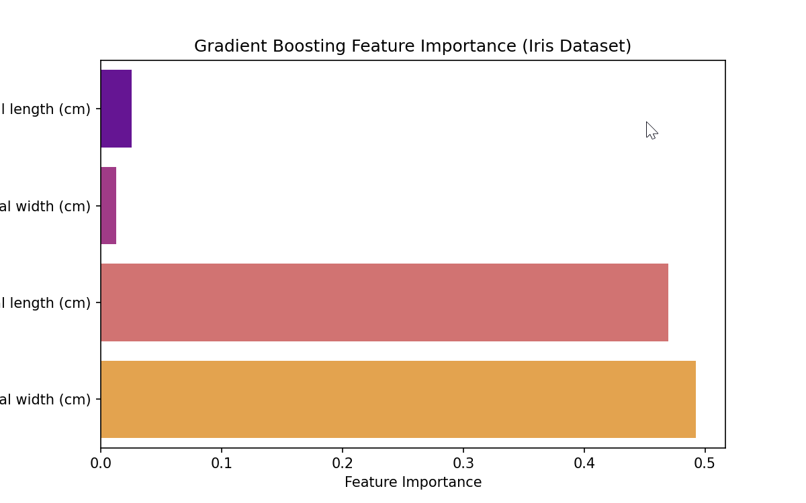

# 🚀 Project 14 - Gradient Boosting Classifier (XGBoost/LightGBM)

## 📌 Overview
This project demonstrates a **Gradient Boosting Classifier** using the Iris dataset.  
It trains an ensemble model with either **XGBoost** or **LightGBM** depending on which is installed.



## 🚀 How to Run
1. Activate your environment:
   ```bash
   venv\Scripts\activate

2. Navigate to the project folder:

    cd Day-14-Gradient-Boosting


3. Install dependencies:

    pip install -r requirements.txt

4. Run the script:

    python gradient_boosting.py

# ✨ Example Output

    ✅ Using XGBoost Classifier
    ✅ Accuracy: 0.97

```📊 Classification Report:
              precision    recall  f1-score   support
setosa           1.00      1.00      1.00        15
versicolor       0.93      1.00      0.97        15
virginica        1.00      0.93      0.97        15

📉 Confusion Matrix:
[[15  0  0]
 [ 0 15  0]
 [ 0  1 14]]

It also plots a feature importance bar chart.
```

# 🧠 Learning Goals

- Understand Gradient Boosting as an ensemble technique.

- Compare with Random Forest (Day 13) and SVM (Day 12).

- Learn how XGBoost and LightGBM can be used interchangeably.

- Interpret feature importance to explain model decisions.