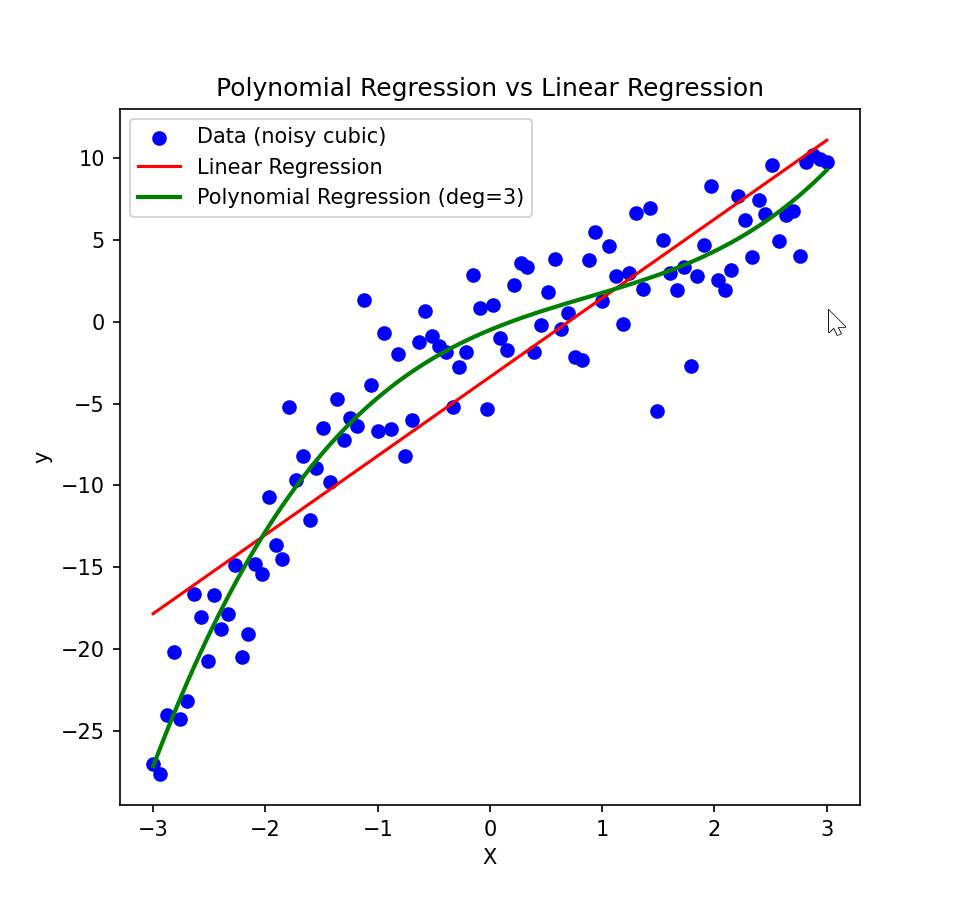

# 🚀 Project 15 - Polynomial Regression

## 📌 Overview
This project demonstrates **Polynomial Regression** using Scikit-Learn.  
It compares a simple **Linear Regression** with a **Polynomial Regression (degree=3)** to fit a non-linear dataset.



## 🚀 How to Run

1. Activate your environment:
   ```bash
   venv\Scripts\activate

2. Navigate to the project folder:

    ``cd Day-15-Polynomial-Regression

3. Install dependencies:

    ``pip install -r requirements.txt

4. Run the script:

    ```python polynomial_regression.py

✨ Example Output
   
     ```📊 Linear Regression R²: 0.8181600159807446
    📊 Polynomial Regression R²: 0.920121611346604


A plot will show:

Blue dots → noisy cubic dataset

Red line → Linear regression (poor fit)

Green curve → Polynomial regression (better fit)
```

# 🧠 Learning Goals

- Learn how to use PolynomialFeatures from scikit-learn.

- Understand why linear models fail on non-linear data.

- See how higher-degree polynomials can improve fit.

-  Compare R² scores to evaluate performance.