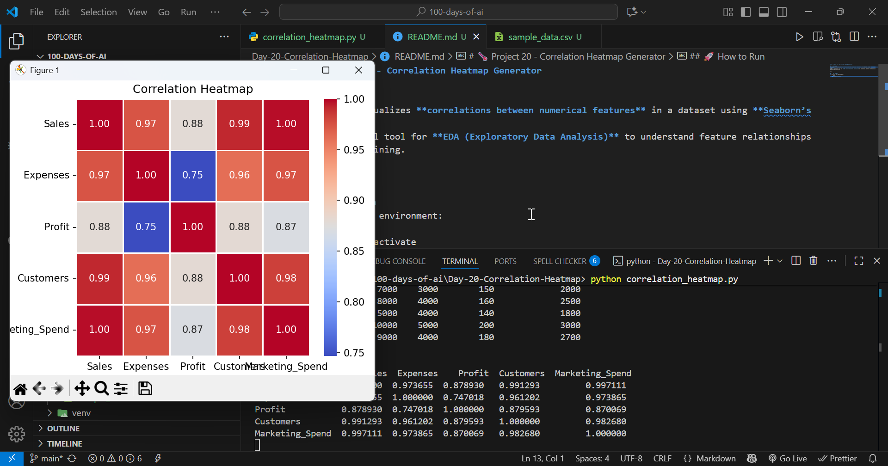

# 🌡️ Project 20 - Correlation Heatmap Generator

## 📌 Overview
This project visualizes **correlations between numerical features** in a dataset using **Seaborn’s heatmap**.  
It’s an essential tool for **EDA (Exploratory Data Analysis)** to understand feature relationships before model training.



## 🚀 How to Run
1. Activate your environment:
   ```bash
   venv\Scripts\activate
