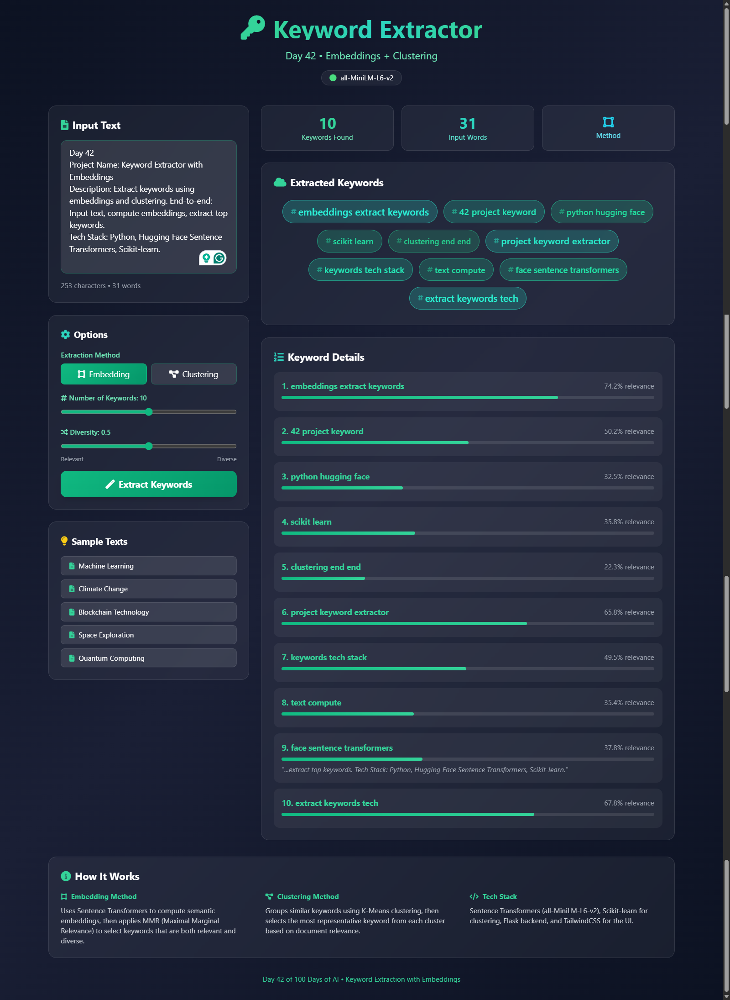

# Day 42: Keyword Extractor with Embeddings 🔑

Extract keywords using semantic embeddings and clustering algorithms.

## 🌟 Features

- **Embedding-based Extraction**: Uses Sentence Transformers for semantic understanding
- **MMR Algorithm**: Maximal Marginal Relevance for diverse keyword selection
- **Clustering Method**: K-Means clustering to find keyword themes
- **Relevance Scoring**: Each keyword ranked by document similarity
- **Context Snippets**: Shows where keywords appear in text
- **Interactive UI**: Keyword cloud with relevance-based sizing



## 🛠️ Tech Stack

- **Backend**: Python, Flask
- **Embeddings**: Sentence Transformers (all-MiniLM-L6-v2)
- **Clustering**: Scikit-learn (K-Means)
- **Frontend**: Tailwind CSS, Font Awesome

## 📦 Installation

```bash
cd Day-42-Keyword-Extractor
pip install -r requirements.txt
python app.py
```

## 🚀 Usage

1. Run `python app.py`
2. Open http://127.0.0.1:5000
3. Enter/paste text (min 50 characters)
4. Choose extraction method
5. Click "Extract Keywords"

## 🧠 Methods

### Embedding Method (MMR)
1. Extract candidate n-grams from text
2. Compute embeddings for document and candidates
3. Apply MMR to balance relevance and diversity

### Clustering Method
1. Extract and embed candidate keywords
2. Cluster using K-Means
3. Select most relevant keyword per cluster

## ⚙️ Parameters

| Parameter | Description | Range |
|-----------|-------------|-------|
| Number of Keywords | How many to extract | 5-15 |
| Diversity | Balance relevance vs variety | 0-1 |

## 📊 Sample Topics

- Machine Learning
- Climate Change
- Blockchain Technology
- Space Exploration
- Quantum Computing

---
Day 42 of 100 Days of AI 🚀
