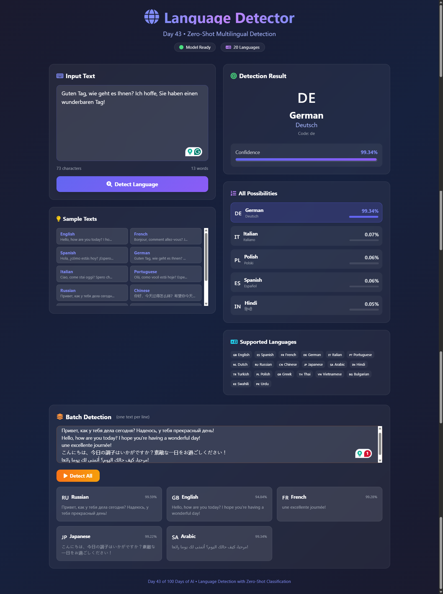

# Day 43: Language Detector 🌍

Detect language using LLM zero-shot classification with support for 30+ languages.



## 🌟 Features

- **Zero-Shot Detection**: Uses BART-MNLI for multilingual classification
- **30 Languages**: Support for major world languages
- **Confidence Scores**: See detection probability for each language
- **Batch Detection**: Detect multiple texts at once
- **Beautiful UI**: Flags, native names, and visual confidence bars
- **Sample Texts**: Pre-loaded examples in 12 languages

## 🛠️ Tech Stack

- **Backend**: Python, Flask
- **AI**: Hugging Face Transformers (facebook/bart-large-mnli)
- **Frontend**: Tailwind CSS, Font Awesome

## 📦 Installation

This project uses its own virtual environment:

```bash
cd Day-43-Language-Detector

# Create virtual environment
python -m venv venv

# Activate (Windows)
venv\Scripts\activate

# Activate (Mac/Linux)
source venv/bin/activate

# Install dependencies
pip install -r requirements.txt

# Run
python app.py
```

## 🚀 Usage

1. Activate the virtual environment
2. Run `python app.py`
3. Open http://127.0.0.1:5000
4. Enter text in any language
5. Click "Detect Language"

## 🌐 Supported Languages

| Language | Flag | Language | Flag |
|----------|------|----------|------|
| English | 🇬🇧 | Russian | 🇷🇺 |
| Spanish | 🇪🇸 | Chinese | 🇨🇳 |
| French | 🇫🇷 | Japanese | 🇯🇵 |
| German | 🇩🇪 | Korean | 🇰🇷 |
| Italian | 🇮🇹 | Arabic | 🇸🇦 |
| Portuguese | 🇵🇹 | Hindi | 🇮🇳 |
| Dutch | 🇳🇱 | Turkish | 🇹🇷 |

*...and 16 more languages!*

## 📊 API Endpoints

| Endpoint | Method | Description |
|----------|--------|-------------|
| `/detect` | POST | Detect single text |
| `/detect-batch` | POST | Detect multiple texts |
| `/languages` | GET | List supported languages |
| `/sample-texts` | GET | Get sample texts |

## ⚙️ How It Works

1. Text is sent to BART-MNLI model
2. Zero-shot classification with hypothesis: "This text is written in {language}"
3. Returns probability scores for each language
4. Top result shown with confidence percentage

---
Day 43 of 100 Days of AI 🚀
