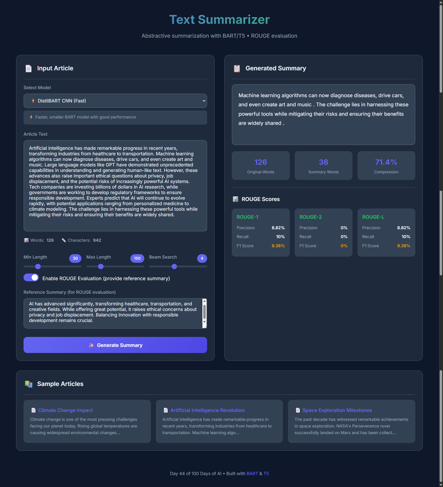

# Day 44: Text Summarizer (Abstractive with BART/T5)

An end-to-end text summarization application using state-of-the-art transformer models (BART and T5) for abstractive summarization with ROUGE score evaluation.



## 🌟 Features

- **Multiple Models**: Choose from 4 different summarization models
  - ⚡ **DistilBART CNN** - Fast and efficient
  - 📰 **BART Large CNN** - Best for news articles
  - 🔤 **T5 Small** - General purpose
  - 📝 **T5 Base** - Higher quality output

- **Abstractive Summarization**: Generates new sentences, not just extracts
- **ROUGE Evaluation**: Compare against reference summaries
  - ROUGE-1 (unigram overlap)
  - ROUGE-2 (bigram overlap)
  - ROUGE-L (longest common subsequence)

- **Customizable Parameters**:
  - Minimum/Maximum summary length
  - Beam search width for quality control

- **Beautiful UI**: Modern, responsive interface
- **Sample Articles**: Pre-loaded examples for testing

## 🛠️ Tech Stack

- **Backend**: Flask, Python 3.10+
- **AI Models**: Hugging Face Transformers
  - `facebook/bart-large-cnn`
  - `sshleifer/distilbart-cnn-12-6`
  - `t5-small`, `t5-base`
- **Evaluation**: rouge-score library
- **Frontend**: HTML5, CSS3, JavaScript

## 📦 Installation

1. **Navigate to project directory**:
   ```bash
   cd Day-44-Text-Summarizer
   ```

2. **Create virtual environment**:
   ```bash
   python -m venv venv
   ```

3. **Activate virtual environment**:
   - Windows:
     ```bash
     venv\Scripts\activate
     ```
   - Linux/Mac:
     ```bash
     source venv/bin/activate
     ```

4. **Install dependencies**:
   ```bash
   pip install -r requirements.txt
   ```

5. **Run the application**:
   ```bash
   python app.py
   ```

6. **Open in browser**:
   ```
   http://localhost:5000
   ```

## 🚀 Usage

### Basic Summarization
1. Select a model from the dropdown
2. Paste your article text
3. Adjust summary length parameters
4. Click "Generate Summary"

### ROUGE Evaluation
1. Enable "ROUGE Evaluation" toggle
2. Provide a reference summary
3. Generate summary to see ROUGE scores

### Sample Articles
- Click on any sample article card to load it
- Reference summaries are included for ROUGE testing

## 📊 Understanding ROUGE Scores

| Metric | Description |
|--------|-------------|
| **ROUGE-1** | Unigram (single word) overlap |
| **ROUGE-2** | Bigram (two-word) overlap |
| **ROUGE-L** | Longest common subsequence |

Each metric shows:
- **Precision**: What % of summary words appear in reference
- **Recall**: What % of reference words appear in summary
- **F1 Score**: Harmonic mean of precision and recall

## 🔧 API Endpoints

| Endpoint | Method | Description |
|----------|--------|-------------|
| `/` | GET | Main interface |
| `/summarize` | POST | Generate summary |
| `/models` | GET | List available models |
| `/model-status` | GET | Check model status |
| `/sample-articles` | GET | Get sample articles |

### Example API Request

```python
import requests

response = requests.post('http://localhost:5000/summarize', json={
    'text': 'Your article text here...',
    'model': 'distilbart',
    'min_length': 30,
    'max_length': 150,
    'reference_summary': 'Optional reference for ROUGE'
})

data = response.json()
print(data['summary'])
print(data['rouge_scores'])
```

## 📈 Model Comparison

| Model | Speed | Quality | Best For |
|-------|-------|---------|----------|
| DistilBART | ⚡⚡⚡ | ★★★☆ | Quick summaries |
| BART Large | ⚡ | ★★★★ | News articles |
| T5 Small | ⚡⚡ | ★★★☆ | General text |
| T5 Base | ⚡ | ★★★★ | High quality |

## 📝 Example

**Input Article**:
> Climate change is one of the most pressing challenges facing our planet today. Rising global temperatures are causing widespread environmental changes...

**Generated Summary**:
> Climate change poses a major threat with rising temperatures causing environmental damage. The Paris Agreement aims to limit warming to 1.5°C, but current efforts may be insufficient.

**ROUGE Scores** (vs reference):
- ROUGE-1 F1: 45.2%
- ROUGE-2 F1: 22.1%
- ROUGE-L F1: 38.7%

## 🧠 How It Works

1. **Input Processing**: Text is tokenized and truncated to model's max length
2. **Encoding**: Model encodes input into contextual representations
3. **Decoding**: Beam search generates summary tokens
4. **Post-processing**: Tokens decoded back to text
5. **Evaluation**: ROUGE scores computed against reference

## 📚 References

- [BART Paper](https://arxiv.org/abs/1910.13461)
- [T5 Paper](https://arxiv.org/abs/1910.10683)
- [ROUGE Metric](https://aclanthology.org/W04-1013/)
- [Hugging Face Transformers](https://huggingface.co/docs/transformers)

## 📄 License

MIT License - Part of 100 Days of AI Challenge

---

**Day 44 of 100 Days of AI** 🚀
