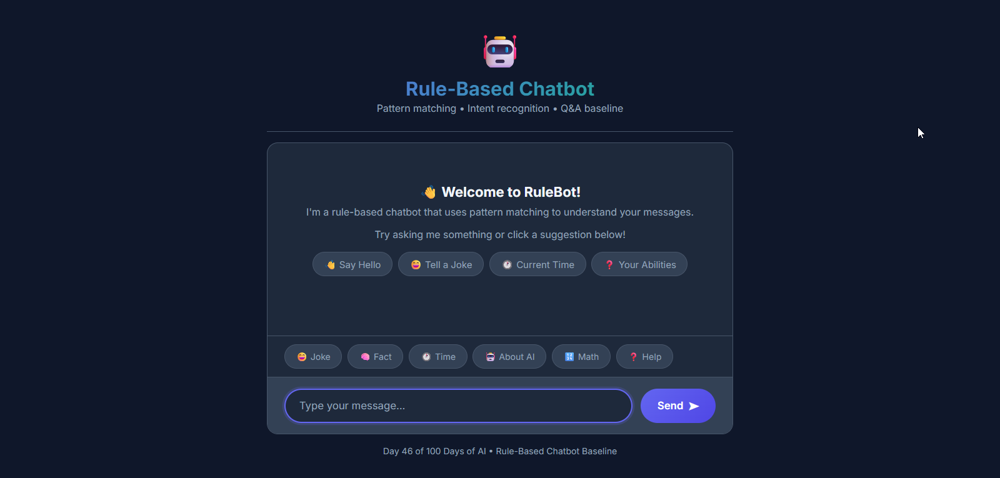
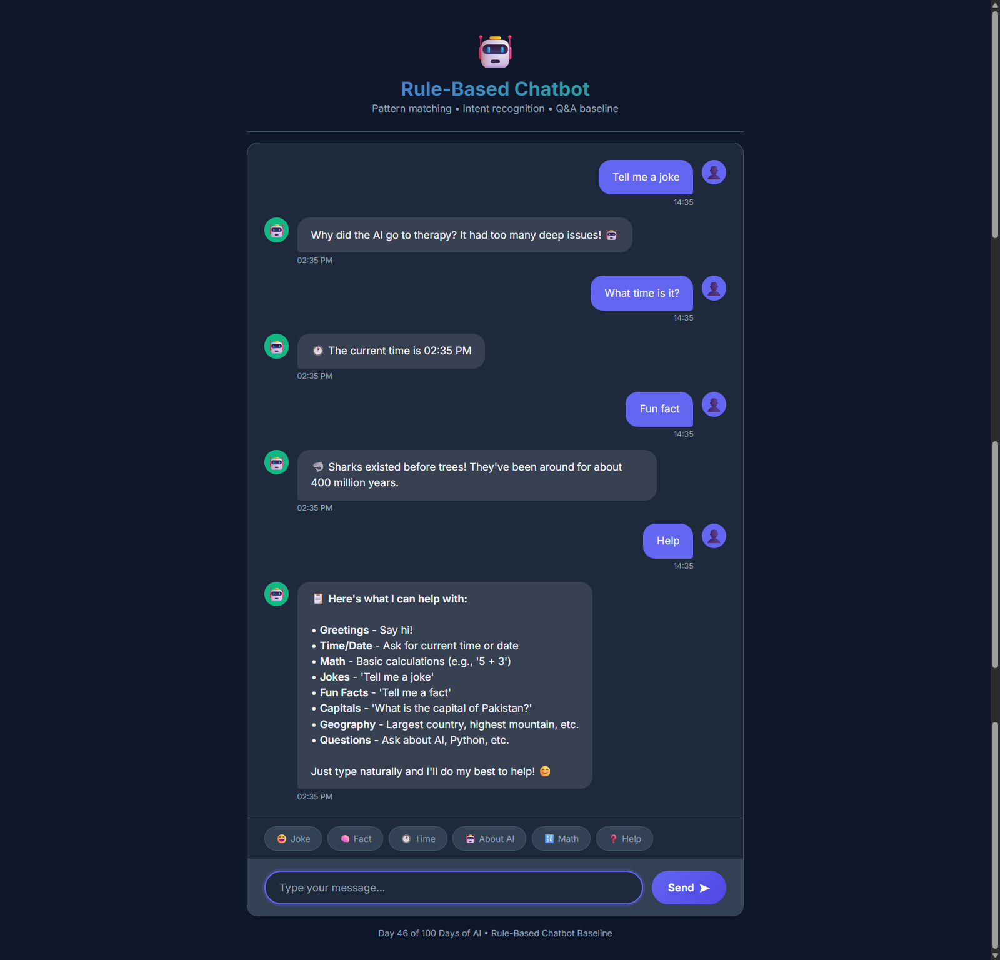

# Day 46: Rule-Based Chatbot (As Baseline)

A simple rule-based chatbot using pattern matching and predefined responses. This serves as a baseline before implementing more advanced NLP/AI chatbots.

## 🎯 Project Overview

This project demonstrates the fundamentals of chatbot development using:
- **Pattern Matching**: Regular expressions to identify user intent
- **Intent Recognition**: Categorizing user messages into predefined intents
- **Response Generation**: Selecting appropriate responses based on matched patterns
- **Dynamic Responses**: Real-time data for time, date, and math calculations

| | |
|---|---|
|  |  |

## ✨ Features

### Supported Intents
| Intent | Description | Example |
|--------|-------------|---------|
| 👋 Greeting | Say hello | "Hi", "Hello", "Good morning" |
| 👋 Farewell | Say goodbye | "Bye", "See you", "Goodbye" |
| ❓ Bot Identity | Ask about the bot | "Who are you?", "What's your name?" |
| 💪 Capabilities | What can it do | "What can you do?", "Help" |
| 🕐 Time | Current time | "What time is it?" |
| 📅 Date | Current date | "What's today's date?" |
| 😄 Jokes | Tell a joke | "Tell me a joke" |
| 🧠 Fun Facts | Share interesting facts | "Tell me a fact" |
| 🔢 Math | Basic calculations | "5 + 3", "10 * 4", "20 / 5" |
| 🤖 AI Info | Learn about AI | "What is AI?" |
| 🐍 Python Info | Learn about Python | "What is Python?" |
| 💬 Conversation | General chat | Various responses |

### Key Features
- 🎨 Modern chat interface with message bubbles
- ⚡ Real-time responses
- 🎯 Pattern-based intent matching
- 🔄 Multiple response variations per intent
- 📱 Responsive design
- ⌨️ Quick action buttons
- 💬 Typing indicator animation

## 🛠️ Technology Stack

- **Backend**: Python, Flask
- **Frontend**: HTML, CSS, JavaScript
- **Pattern Matching**: Python `re` module
- **No External AI**: Pure rule-based logic

## 📁 Project Structure

```
Day-46-Rule-Based-Chatbot/
├── app.py              # Flask application with chatbot logic
├── templates/
│   └── index.html      # Chat interface
├── requirements.txt    # Dependencies
├── README.md          # Documentation
└── .gitignore         # Git ignore file
```

## 🚀 Getting Started

### Prerequisites
- Python 3.8+

### Installation

1. **Navigate to project directory**
   ```bash
   cd Day-46-Rule-Based-Chatbot
   ```

2. **Create virtual environment**
   ```bash
   python -m venv venv
   ```

3. **Activate virtual environment**
   ```bash
   # Windows
   venv\Scripts\activate
   
   # macOS/Linux
   source venv/bin/activate
   ```

4. **Install dependencies**
   ```bash
   pip install -r requirements.txt
   ```

5. **Run the application**
   ```bash
   python app.py
   ```

6. **Open browser**
   ```
   http://localhost:5000
   ```

## 💡 How It Works

### 1. Pattern Definition
Each intent has regex patterns that match user input:
```python
"greeting": {
    "patterns": [
        r"\b(hi|hello|hey|howdy)\b",
        r"\bgood\s*(morning|afternoon|evening)\b"
    ],
    "responses": [
        "Hello! How can I help you?",
        "Hi there! What can I do for you?"
    ]
}
```

### 2. Intent Matching
User input is checked against all patterns:
```python
for intent_name, intent_data in INTENTS.items():
    for pattern in intent_data["patterns"]:
        if re.search(pattern, message_lower):
            return random.choice(intent_data["responses"])
```

### 3. Dynamic Responses
Some responses require real-time data:
- **Time**: Returns current system time
- **Date**: Returns current date
- **Math**: Parses and calculates expressions

### 4. Fallback
If no pattern matches, a default response is returned.

## 📊 Statistics

- **Total Intents**: 20+
- **Pattern Rules**: 60+
- **Response Variations**: 80+

## 🎮 Try These Commands

```
Hello!
What time is it?
Tell me a joke
5 + 3
What is AI?
Fun fact
Who are you?
What's 100 divided by 4?
Help
```

## 🔮 Comparison: Rule-Based vs AI Chatbots

| Aspect | Rule-Based | AI/ML-Based |
|--------|-----------|-------------|
| Setup | Quick & Simple | Complex training |
| Responses | Predictable | Context-aware |
| Scalability | Limited | Highly scalable |
| Maintenance | Manual updates | Self-learning |
| Accuracy | Pattern-dependent | Improves over time |
| Resources | Minimal | GPU/High compute |

## 🚀 Future Improvements

- [ ] Add more intents and patterns
- [ ] Implement context awareness
- [ ] Add conversation history
- [ ] Integrate with AI models (Day 47+)
- [ ] Add database for learning

## 📝 API Endpoints

| Endpoint | Method | Description |
|----------|--------|-------------|
| `/` | GET | Chat interface |
| `/chat` | POST | Send message, get response |
| `/info` | GET | Bot statistics |
| `/intents` | GET | List all intents (debug) |

## 🤝 Contributing

This is part of the 100 Days of AI challenge. Feel free to fork and experiment!

## 📄 License

MIT License - Feel free to use and modify!

---

**Day 46 of 100 Days of AI** 🚀

*Building the foundation for smarter chatbots!*
