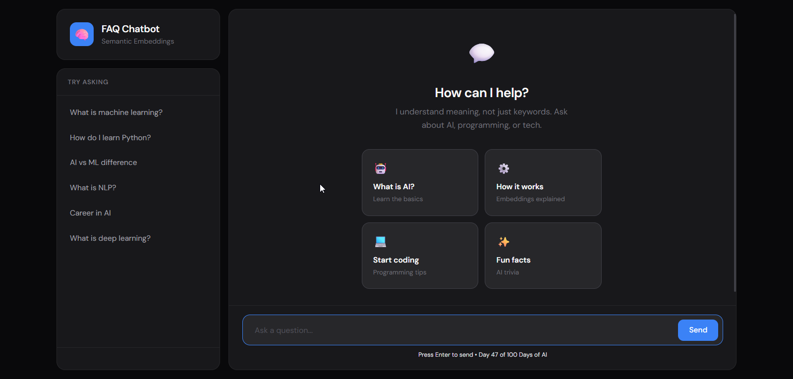
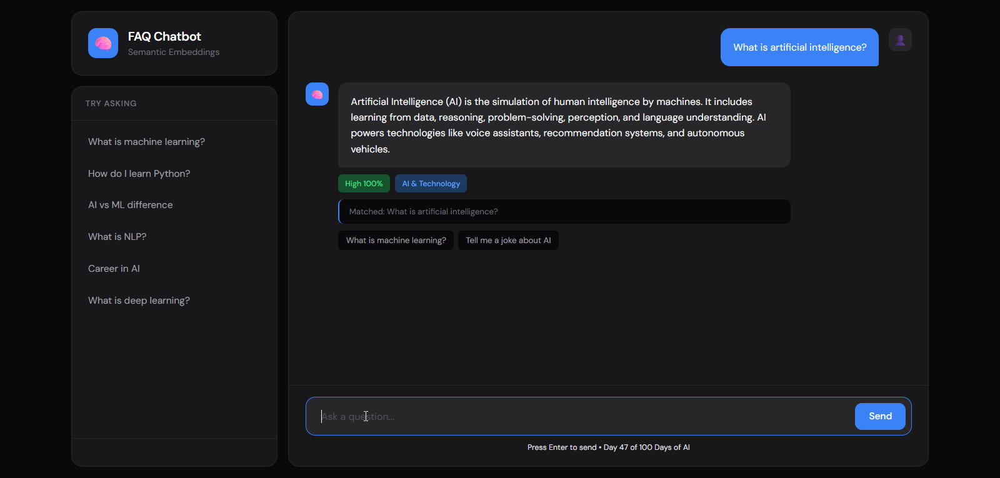

# Day 47: FAQ Chatbot with Embeddings 🧠

A semantic FAQ chatbot that uses Sentence Transformers to understand and match user queries based on meaning, not just keywords!


## 🎯 What This Project Does

Unlike traditional keyword-based chatbots, this FAQ chatbot uses **semantic embeddings** to understand the *meaning* behind your questions:

- **Semantic Matching**: Understands "How do I begin coding?" is similar to "How do I start programming?"
- **384-Dimensional Vectors**: Converts text into mathematical representations capturing semantic meaning
- **Cosine Similarity**: Measures how similar two questions are in meaning space
- **Confidence Scores**: Shows how confident the bot is in its answers

 

## 🚀 Features

- 🧠 **Sentence Transformers** - State-of-the-art embedding model (all-MiniLM-L6-v2)
- 🔍 **Semantic Search** - Find answers based on meaning, not exact matches
- 📊 **Confidence Display** - See how sure the bot is about each answer
- 💡 **Related Suggestions** - Get similar questions you might want to ask
- 📁 **Category Organization** - FAQs organized into logical categories
- 🎨 **Modern UI** - Beautiful, responsive chat interface

## 📦 Installation

1. **Navigate to the project folder:**
   ```bash
   cd Day-47-FAQ-Chatbot-Embeddings
   ```

2. **Create a virtual environment:**
   ```bash
   python -m venv venv
   ```

3. **Activate the virtual environment:**
   
   Windows:
   ```bash
   venv\Scripts\activate
   ```
   
   Linux/Mac:
   ```bash
   source venv/bin/activate
   ```

4. **Install dependencies:**
   ```bash
   pip install -r requirements.txt
   ```

5. **Run the application:**
   ```bash
   python app.py
   ```

6. **Open in browser:**
   ```
   http://localhost:5000
   ```

## 🔬 How Embeddings Work

### The Concept

Traditional keyword matching:
```
User: "How do I begin coding?"
FAQ: "How do I start programming?" 
Result: ❌ No match (different words)
```

Embedding-based matching:
```
User: "How do I begin coding?"
Embedding: [0.23, -0.45, 0.12, ... 381 more dimensions]

FAQ: "How do I start programming?"
Embedding: [0.21, -0.43, 0.14, ... 381 more dimensions]

Cosine Similarity: 0.89 (89% similar!)
Result: ✅ Match found!
```

### The Process

1. **Load Model**: Sentence Transformers (all-MiniLM-L6-v2)
2. **Generate Embeddings**: Convert all FAQ questions to 384-dimensional vectors
3. **Query Embedding**: Convert user's question to the same vector space
4. **Cosine Similarity**: Calculate similarity between query and all FAQs
5. **Best Match**: Return the FAQ with highest similarity (if above threshold)

## 🏗️ Project Structure

```
Day-47-FAQ-Chatbot-Embeddings/
├── app.py                # Main Flask application with FAQEngine
├── requirements.txt      # Python dependencies
├── README.md            # Documentation
├── .gitignore           # Git ignore file
├── venv/                # Virtual environment
└── templates/
    └── index.html       # Chat interface
```

## 🎮 API Endpoints

| Endpoint | Method | Description |
|----------|--------|-------------|
| `/` | GET | Main chat interface |
| `/chat` | POST | Send a message and get response |
| `/faqs` | GET | Get all FAQs with categories |
| `/stats` | GET | Get chatbot statistics |
| `/search` | POST | Search FAQs by keyword |

## 🧪 Example Requests

### Chat
```bash
curl -X POST http://localhost:5000/chat \
  -H "Content-Type: application/json" \
  -d '{"message": "What is machine learning?"}'
```

Response:
```json
{
  "success": true,
  "answer": "Machine Learning is a subset of AI...",
  "matched_question": "What is machine learning?",
  "confidence": 0.95,
  "category": "AI & Technology",
  "suggestions": ["What is deep learning?", "How does AI work?"]
}
```

### Get Stats
```bash
curl http://localhost:5000/stats
```

## 📊 Knowledge Base Categories

- 🌐 **General** - Basic greetings and info
- 🤖 **AI & Technology** - AI, ML, NLP concepts
- 💻 **Programming** - Coding languages and learning
- 💼 **Career** - Jobs and career advice
- 🤖 **Chatbot** - How this chatbot works
- 😄 **Fun** - Jokes and fun facts
- 📚 **100 Days of AI** - Project information
- 🛠️ **Support** - Help and contact

## 🔧 Technical Details

### Model: all-MiniLM-L6-v2
- **Embedding Dimension**: 384
- **Speed**: Fast inference (~14ms per query)
- **Quality**: Excellent semantic understanding
- **Size**: ~80MB

### Similarity Threshold
- **Default**: 0.5 (50%)
- **High Confidence**: ≥0.7 (70%)
- **Medium Confidence**: 0.5-0.7
- **Low/No Match**: <0.5

## 📈 Why Embeddings > Keywords?

| Feature | Keyword Matching | Embedding Matching |
|---------|-----------------|-------------------|
| Synonym Understanding | ❌ | ✅ |
| Semantic Similarity | ❌ | ✅ |
| Typo Tolerance | ❌ | ✅ |
| Context Understanding | ❌ | ✅ |
| Multi-lingual | ❌ | ✅ |

## 🎓 Learning Outcomes

By building this project, you'll learn:

1. **Sentence Transformers** - How to use pre-trained embedding models
2. **Vector Representations** - Understanding semantic embeddings
3. **Cosine Similarity** - Measuring similarity in vector space
4. **Semantic Search** - Building meaning-based search systems
5. **Flask APIs** - Creating REST endpoints

## 🔗 Related Projects

- **Day 46**: Rule-Based Chatbot (Pattern Matching)
- **Day 34**: Word2Vec Sentence Embeddings
- **Day 44**: Text Summarizer

## 📝 License

This project is part of the 100 Days of AI challenge.

---

**Day 47 of 100** - Building AI, one day at a time! 🚀
