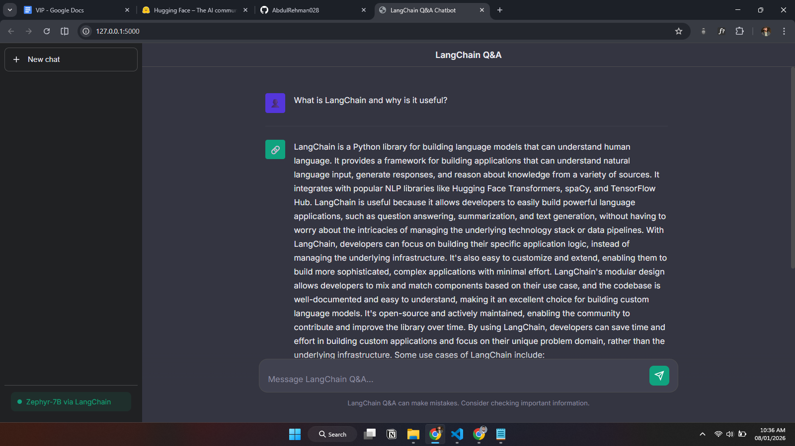
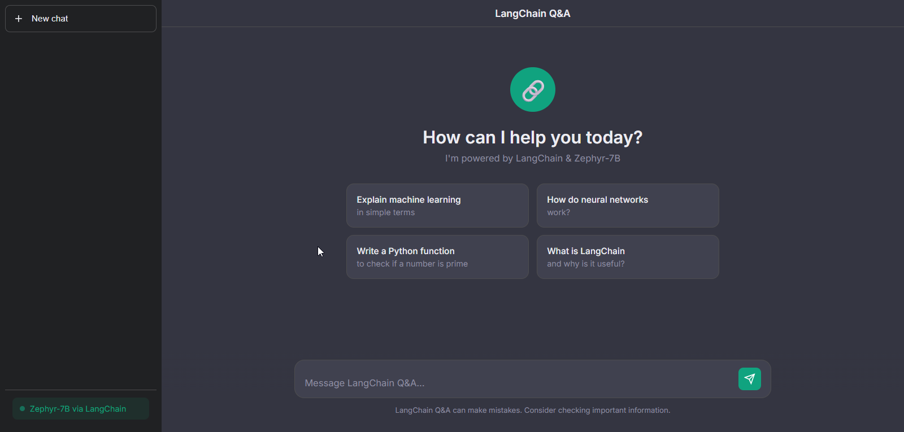

# Day 49: LangChain Q&A Chatbot 🔗

A powerful Q&A chatbot built with LangChain and Hugging Face's Zephyr-7B-Beta featuring a ChatGPT-style interface!






## 🎯 What This Project Does

This project implements a **Q&A chatbot** using LangChain with a custom LLM wrapper:

- **LangChain**: Framework for building LLM applications
- **Custom LLM Wrapper**: HuggingFace InferenceClient integration
- **Zephyr-7B-Beta**: Powerful instruction-tuned chat model
- **LCEL**: LangChain Expression Language for clean chains
- **ChatGPT-style UI**: Modern dark theme interface

## 🔗 LangChain Chain Architecture

```
User Input
    │
    ▼
┌─────────────────────────┐
│     PromptTemplate      │  ← System prompt + Conversation history
└─────────────────────────┘
    │
    ▼
┌─────────────────────────┐
│   HuggingFaceLLM        │  ← Custom wrapper using InferenceClient
│   (chat_completion)     │  ← Zephyr-7B-Beta model
└─────────────────────────┘
    │
    ▼
┌─────────────────────────┐
│    StrOutputParser      │  ← Extract string response
└─────────────────────────┘
    │
    ▼
Response
```

## 🚀 Features

- 🔗 **LangChain Integration** - Modern LCEL chain composition
- 🌀 **Zephyr-7B-Beta** - High-quality instruction-tuned responses
- 💬 **ChatGPT-style UI** - Dark theme, suggestion cards, typing indicator
- 📜 **Conversation Memory** - Maintains context across messages
- 🎨 **Responsive Design** - Works on desktop and mobile
- 🔑 **Auto-initialization** - Token loaded from .env file

## 📦 Installation

1. **Navigate to the project folder:**
   ```bash
   cd Day-49-LangChain-QA-Chatbot
   ```

2. **Create a virtual environment:**
   ```bash
   python -m venv venv
   ```

3. **Activate the virtual environment:**
   
   Windows:
   ```bash
   venv\Scripts\activate
   ```
   
   Linux/Mac:
   ```bash
   source venv/bin/activate
   ```

4. **Install dependencies:**
   ```bash
   pip install -r requirements.txt
   ```

5. **Run the application:**
   ```bash
   python app.py
   ```

6. **Open in browser:**
   ```
   http://localhost:5000
   ```

## 🔑 Setting Up Your HuggingFace Token

1. Go to [huggingface.co/settings/tokens](https://huggingface.co/settings/tokens)
2. Click "New token"
3. Give it a name and select "Read" access
4. Copy the token
5. Create a `.env` file in the project root:
   ```
   HUGGINGFACEHUB_API_TOKEN=your_token_here
   ```

The app auto-loads the token on startup - no manual initialization needed!

## 🏗️ Project Structure

```
Day-49-LangChain-QA-Chatbot/
├── app.py                # Main Flask app with LangChain
├── requirements.txt      # Python dependencies
├── README.md            # Documentation
├── .gitignore           # Git ignore file
├── .env                 # HuggingFace API token (create this)
└── templates/
    └── index.html       # ChatGPT-style dark UI
```

## 🧠 Key LangChain Concepts

### 1. Custom LLM Wrapper
```python
class HuggingFaceLLM(LLM):
    def _call(self, prompt: str, **kwargs) -> str:
        response = self.client.chat_completion(
            messages=[{"role": "user", "content": prompt}],
            model=self.model_name,
            max_tokens=512
        )
        return response.choices[0].message.content
```

### 2. PromptTemplate with History
```python
prompt = PromptTemplate(
    input_variables=["history", "input"],
    template="""You are a helpful AI assistant...\n
    Conversation history:\n{history}\n
    Human: {input}\nAssistant:"""
)
```

### 3. LCEL Chain Composition
```python
chain = prompt | llm | StrOutputParser()
response = chain.invoke({"input": question, "history": history})
```

## 🎮 API Endpoints

| Endpoint | Method | Description |
|----------|--------|-------------|
| `/` | GET | ChatGPT-style chat interface |
| `/ask` | POST | Send question, get answer |
| `/clear` | POST | Clear conversation history |
| `/history` | GET | Get conversation history |
| `/status` | GET | Check if chatbot is ready |

## 🔬 Why LangChain?

| Feature | Raw API | LangChain |
|---------|---------|-----------|
| Prompt Management | Manual | ✅ Templates |
| Chat History | Manual | ✅ Built-in |
| Output Parsing | Manual | ✅ Parsers |
| Chain Composition | Complex | ✅ LCEL (|) |
| Model Switching | Rewrite | ✅ Swap |

## 📊 LLM vs ChatModel

| Type | Messages | Use Case |
|------|----------|----------|
| **LLM** | Single text input | Completion |
| **ChatModel** | System/Human/AI messages | Conversation |

This project uses **ChatModel** for proper conversational experience!

## 🆚 Day 46 → 47 → 48 → 49 Evolution

| Day | Approach | Intelligence |
|-----|----------|--------------|
| 46 | Rule-Based | Pattern matching |
| 47 | Embeddings | Semantic search |
| 48 | DialoGPT | Casual chat LLM |
| **49** | **LangChain** | **Q&A with ChatModel** |

## 🎓 Learning Outcomes

By building this project, you'll learn:

1. **LangChain Basics** - Chains, prompts, models
2. **ChatModel vs LLM** - Proper chat interfaces
3. **LCEL** - LangChain Expression Language
4. **Prompt Engineering** - System prompts for behavior
5. **HuggingFace Hub** - Using hosted inference API

## 🔧 Customization

### Change the Model
```python
# In HuggingFaceLLM class
model_name: str = "mistralai/Mistral-7B-Instruct-v0.2"
# or
model_name: str = "meta-llama/Llama-2-7b-chat-hf"
```

### Adjust Generation Parameters
```python
response = self.client.chat_completion(
    messages=messages,
    model=self.model_name,
    max_tokens=1024,      # Longer responses
    temperature=0.9,      # More creative
)
```

### Custom System Prompt
```python
self.prompt = PromptTemplate(
    template="""You are a Python expert. Only answer coding questions.
    {history}
    Human: {input}
    Assistant:"""
)
```

## 🎨 UI Features

- **Dark Theme** - ChatGPT-inspired colors (#343541, #202123)
- **Welcome Screen** - Suggestion cards for quick start
- **Typing Indicator** - Bouncing dots while waiting
- **Responsive** - Sidebar hides on mobile
- **Auto-resize Input** - Textarea grows with content
- **Toast Notifications** - Error feedback

## 📚 Resources

- [LangChain Docs](https://python.langchain.com/docs/)
- [Hugging Face Hub](https://huggingface.co/docs/hub/)
- [Zephyr-7B Model](https://huggingface.co/HuggingFaceH4/zephyr-7b-beta)
- [LCEL Guide](https://python.langchain.com/docs/expression_language/)

## 📝 License

This project is part of the 100 Days of AI challenge.

---

**Day 49 of 100** - Building AI, one day at a time! 🚀
