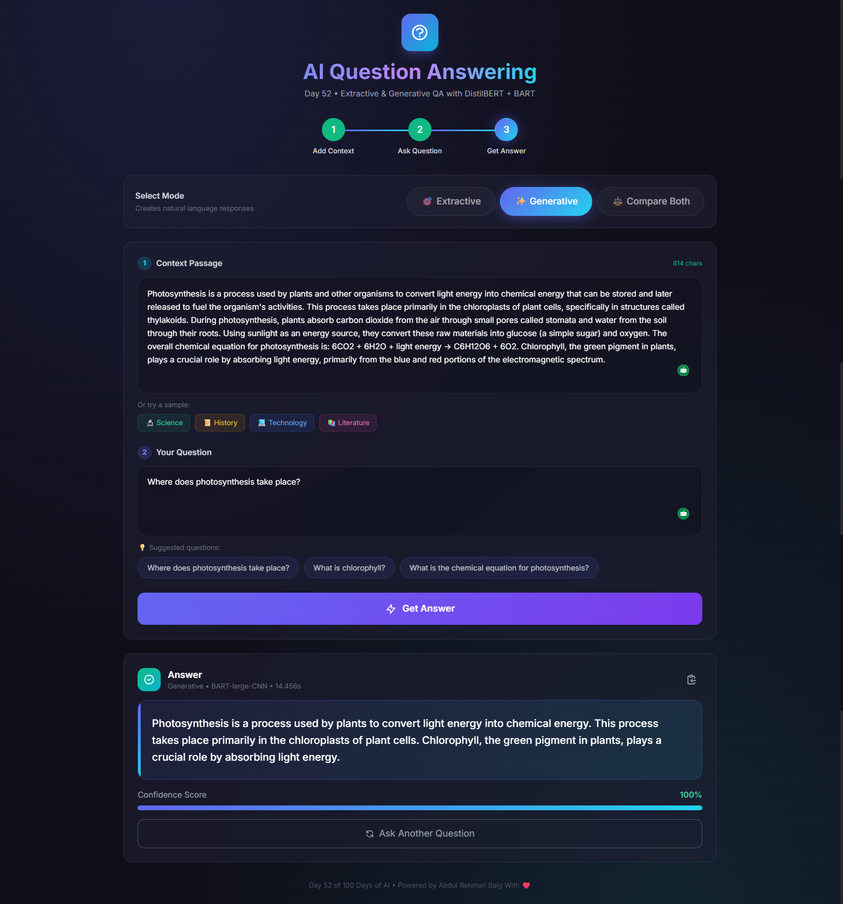

# 🤖 Day 52: Question-Answering System

A dual-mode Question-Answering system that evolves from **Extractive** to **Generative** approaches, demonstrating two fundamental paradigms in NLP.




## 🎯 Overview

This project demonstrates the evolution of Question-Answering systems:

| Mode | Model | Approach | Best For |
|------|-------|----------|----------|
| **Extractive** | DistilBERT-SQuAD | Finds exact answer span in context | Factual questions with explicit answers |
| **Generative** | FLAN-T5-base | Generates natural language answer | Questions requiring synthesis |
| **Hybrid** | Both | Compares both approaches | Understanding model differences |

## ✨ Features

- 🔍 **Extractive QA**: Pinpoints exact answer location with confidence scores
- ✍️ **Generative QA**: Produces fluent, natural language responses
- 🔄 **Hybrid Mode**: Compare both approaches side-by-side
- 📊 **Confidence Scoring**: Visual confidence indicators
- 🎨 **Modern UI**: Beautiful Tailwind CSS dark theme
- 📚 **Sample Contexts**: Pre-loaded examples (Science, History, Tech, Literature)
- ⚡ **Fast Processing**: Optimized model inference

## 🛠️ Tech Stack

- **Backend**: Python, Flask
- **AI Models**: 
  - `distilbert-base-uncased-distilled-squad` (Extractive)
  - `google/flan-t5-base` (Generative)
- **Framework**: Hugging Face Transformers
- **Frontend**: HTML, Tailwind CSS, JavaScript

## 📦 Installation

1. **Create virtual environment**:
   ```bash
   python -m venv venv
   
   # Windows
   .\venv\Scripts\activate
   
   # macOS/Linux
   source venv/bin/activate
   ```

2. **Install dependencies**:
   ```bash
   pip install -r requirements.txt
   ```

3. **Run the application**:
   ```bash
   python app.py
   ```

4. **Open browser**: Navigate to `http://localhost:5000`

## 🚀 Usage

1. **Enter Context**: Paste a paragraph of text (or use sample contexts)
2. **Select Mode**:
   - **Extractive**: For precise, quoted answers
   - **Generative**: For synthesized, natural answers
   - **Hybrid**: To compare both approaches
3. **Ask Question**: Type your question about the context
4. **Get Answer**: View the AI-generated response with confidence

## 📊 Understanding the Modes

### Extractive QA
```
Context: "The Eiffel Tower was built in 1889."
Question: "When was the Eiffel Tower built?"
Answer: "1889" (extracted directly)
Confidence: 98.5%
```

### Generative QA
```
Context: "The Eiffel Tower was built in 1889."
Question: "When was the Eiffel Tower built?"
Answer: "The Eiffel Tower was built in 1889."
```

### Hybrid Mode
Shows both answers with a recommendation on which to trust based on confidence levels.

## 🧠 Model Details

### DistilBERT-SQuAD (Extractive)
- Fine-tuned on Stanford Question Answering Dataset (SQuAD)
- 66M parameters, 40% smaller than BERT
- Identifies start and end positions of answer in context

### FLAN-T5-base (Generative)
- Instruction-tuned T5 model by Google
- 250M parameters
- Generates complete sentences as answers

## 📁 Project Structure

```
Day-52-Question-Answering-System/
├── app.py              # Flask application with QA logic
├── templates/
│   └── index.html      # Modern Tailwind CSS UI
├── requirements.txt    # Python dependencies
├── README.md          # Documentation
└── .gitignore         # Git ignore file
```

## 🎨 Screenshots

### Mode Selection
- Switch between Extractive, Generative, and Hybrid modes
- Visual indicators for active mode

### Answer Display
- Confidence bar visualization
- Highlighted answer in context (extractive)
- Processing time display

### Sample Contexts
- Science (Photosynthesis)
- History (Moon Landing)
- Technology (Machine Learning)
- Literature (Shakespeare)

## 🔧 API Endpoints

| Endpoint | Method | Description |
|----------|--------|-------------|
| `/` | GET | Main interface |
| `/ask` | POST | Submit question and get answer |
| `/health` | GET | System health check |

### POST /ask
```json
{
    "context": "Your context text here...",
    "question": "Your question?",
    "mode": "extractive|generative|hybrid"
}
```

## 📈 Performance Tips

- **First request**: Models are loaded on startup (may take 30-60 seconds)
- **GPU**: If available, CUDA acceleration is automatic
- **Context length**: Keep context under 512 tokens for best results
- **Questions**: Be specific and clear for better answers

## 🎯 Learning Outcomes

- Understanding extractive vs generative QA paradigms
- Working with pre-trained transformer models
- Building interactive NLP applications
- Implementing confidence scoring

## 📝 License

MIT License - Part of the 100 Days of AI Challenge

---

**Day 52 of 100 Days of AI** 🚀

*From Extractive to Generative - Exploring the Evolution of QA Systems*
