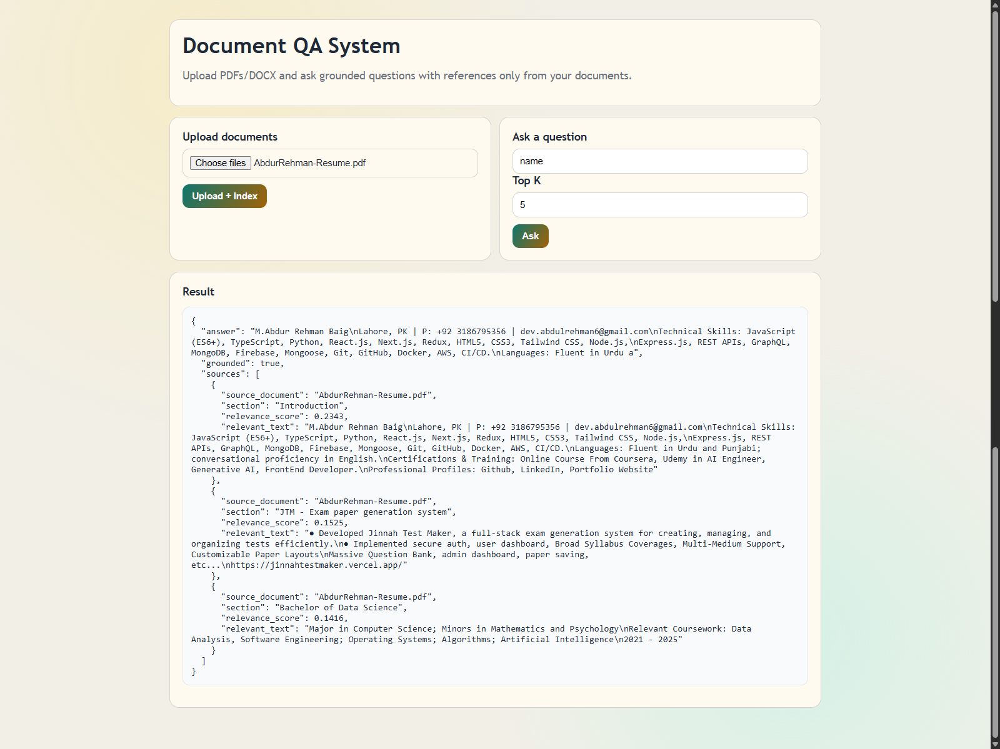

# Day 62 - Document-Based Question Answering System (RAG)

This project is a strict document QA system.
Upload PDF/DOCX files, ask questions, and get answers grounded only in the uploaded content with source references.

This version runs fully local and free using cached Hugging Face models. No paid API is required.

If the answer is not present in retrieved document context, the API returns `not found`.



## Stack

- Python + FastAPI
- Sentence-Transformers (local embeddings)
- Transformers extractive QA (local)
- NumPy cosine vector index (persistent on disk)
- pypdf + python-docx for document extraction

## Features

- Upload and process documents (`.pdf`, `.docx`)
- Text extraction and cleanup
- Logical section detection and chunking
- Embeddings and local vector indexing
- Semantic search (RAG retrieval)
- Grounded answering only from retrieved context
- Structured response with:
  - `answer`
  - `source_document`
  - `section`
  - `relevant_text`
- Hallucination guardrails:
  - Similarity threshold
  - Strict prompt requiring `not found` when unsupported

## Project Structure

```text
Day-62-Document-QA-System/
  backend/
    app/
      core/config.py
      models/schemas.py
      services/
        chunking.py
        document_parser.py
        rag_service.py
        vector_store.py
      templates/index.html
      main.py
    requirements.txt
    .env.example
    Dockerfile
```

## Run Locally

### 1) Install dependencies

```bash
cd Day-62-Document-QA-System/backend
pip install -r requirements.txt
```

### 2) Configure environment

```bash
copy .env.example .env
```

By default it uses local cached models:
- `sentence-transformers/all-MiniLM-L6-v2`
- `distilbert-base-uncased-distilled-squad`

### 3) Start API

```bash
uvicorn app.main:app --reload --host 127.0.0.1 --port 8000
```

Open:
- API docs: `http://127.0.0.1:8000/docs`
- Simple UI: `http://127.0.0.1:8000/`

You can check service readiness at `GET /api/status`.

## API Endpoints

- `GET /health`
- `GET /api/status`
- `POST /api/upload` (multipart form-data, field name: `files`)
- `POST /api/ask`

### Example `POST /api/ask`

```json
{
  "question": "What is the refund period?",
  "top_k": 5
}
```

### Example Response

```json
{
  "answer": "The refund period is 30 days from the purchase date.",
  "grounded": true,
  "sources": [
    {
      "source_document": "Policy.pdf",
      "section": "Refund Policy",
      "relevance_score": 0.8123,
      "relevant_text": "Customers may request a full refund within 30 days ..."
    }
  ]
}
```

If unsupported:

```json
{
  "answer": "not found",
  "grounded": false,
  "sources": []
}
```

## Deploy

### Option A: Docker (recommended)

```bash
cd Day-62-Document-QA-System/backend
docker build -t day62-doc-qa .
docker run -p 8000:8000 --env-file .env day62-doc-qa
```

### Option B: Render/Railway/Fly.io

- Deploy `backend` as a Python web service
- Start command:

```bash
uvicorn app.main:app --host 0.0.0.0 --port $PORT
```

- Ensure your deployment environment has internet during build to download models at least once, or bake model cache into image.

## Notes for Portfolio

- This MVP is retrieval-grounded and avoids open-domain chatbot behavior.
- Answers are constrained to document context with explicit references.
- For production hardening, add auth, rate limits, and a background ingestion queue.
